# Chapter 5: Parametrization

In computer graphics, we denote as surface parametrization a map from the
surface to \\(\mathbf{R}^2\\). It is usually encoded by a new set of 2D
coordinates for each vertex of the mesh (and possibly also by a new set of
faces in one to one correspondence with the faces of the original surface).
Note that
this definition is the *inverse* of the classical differential geometry
definition.

A parametrization has many applications, ranging from texture mapping to
surface remeshing. Many algorithms have been proposed, and they can be broadly
divided in four families:

1. **Single patch, fixed boundary**: these algorithm can parametrize a
disk-like part of the surface given fixed 2D positions for its boundary. These
algorithms are efficient and simple, but they usually produce high-distortion maps due to the fixed boundary.

2. **Single patch, free boundary:** these algorithms let the boundary
deform freely, greatly reducing the map distortion. Care should be taken to
prevent the border to self-intersect.

3. **Global parametrization**: these algorithms work on meshes with arbitrary
genus. They initially cut the mesh in multiple patches that can be separately parametrized. The generated maps are discontinuous on the cuts (often referred as *seams*).

4. **Global seamless parametrization**: these are global parametrization algorithm that hides the seams, making the parametrization "continuous", under specific assumptions that we will discuss later.

## Harmonic parametrization

Harmonic parametrization [^eck_2005] is a single patch, fixed boundary parametrization
algorithm that computes the 2D coordinates of the flattened mesh as two
harmonic functions.

The algorithm is divided in 3 steps:

1. Detect of the boundary vertices
2. Map the boundary vertices to a circle
3. Compute two harmonic functions (one for u and one for the v coordinate). The harmonic functions use the fixed vertices on the circle as boundary constraints.

The algorithm can be coded using libigl as follows:

```cpp
Eigen::VectorXi bnd;
igl::boundary_loop(V,F,bnd);

Eigen::MatrixXd bnd_uv;
igl::map_vertices_to_circle(V,bnd,bnd_uv);

igl::harmonic(V,F,bnd,bnd_uv,1,V_uv);
```

where `bnd` contains the indices of the boundary vertices, bnd_uv their position on the UV plane, and "1" denotes that we want to compute an harmonic function (2 will be for biharmonic, 3 for triharmonic, etc.). Note that each of the three
functions is designed to be reusable in other parametrization algorithms.

A UV parametrization can be visualized in the viewer with:

```cpp
viewer.data().set_uv(V_uv);
```

The UV coordinates are then used to apply a procedural checkerboard texture to the
mesh ([Example 501]({{ repo_url }}/tutorial/501_HarmonicParam/main.cpp)).

) Harmonic parametrization. (left) mesh with texture, (right) UV parametrization with texture](images/501_HarmonicParam.png)

## Least squares conformal maps

Least squares conformal maps parametrization [^levy_2002] minimizes the
conformal (angular) distortion of the parametrization. Differently from
harmonic parametrization, it does not need to have a fixed boundary.

LSCM minimizes the following energy:

\\[ E_{LSCM}(\mathbf{u},\mathbf{v}) = \int_X \frac{1}{2}| \nabla \mathbf{u}^{\perp} - \nabla \mathbf{v} |^2 dA \\]

which can be rewritten in matrix form as [^mullen_2008]:

\\[ E_{LSCM}(\mathbf{u},\mathbf{v}) = \frac{1}{2} [\mathbf{u},\mathbf{v}]^t (L_c - 2A) [\mathbf{u},\mathbf{v}] \\]

where $L_c$ is the cotangent Laplacian matrix and $A$ is a matrix such that
$[\mathbf{u},\mathbf{v}]^t A  [\mathbf{u},\mathbf{v}]$ is equal to the [vector
area](http://en.wikipedia.org/wiki/Vector_area) of the mesh.

Using libigl, this matrix energy can be written in a few lines of code. The
cotangent matrix can be computed using `igl::cotmatrix`:

```cpp
SparseMatrix<double> L;
igl::cotmatrix(V,F,L);
```

Note that we want to apply the Laplacian matrix to the u and v coordinates at
the same time, thus we need to extend it taking the left
Kronecker product with a 2x2 identity matrix:

```cpp
SparseMatrix<double> L_flat;
igl::repdiag(L,2,L_flat);
```

The area matrix is computed with `igl::vector_area_matrix`:

```cpp
SparseMatrix<double> A;
igl::vector_area_matrix(F,A);
```

The final energy matrix is $L_{flat} - 2A$. Note that in this
case we do not need to fix the boundary. To remove the null space of the energy and make the minimum unique, it is sufficient to fix two arbitrary
vertices to two arbitrary positions. The full source code is provided in [Example 502]({{ repo_url }}/tutorial/502_LSCMParam/main.cpp).

) LSCM parametrization. (left) mesh with texture, (right) UV parametrization](images/502_LSCMParam.png)

## As-rigid-as-possible parametrization

As-rigid-as-possible parametrization [^liu_2008] is a powerful single-patch,
non-linear algorithm to compute a parametrization that strives to preserve
distances (and thus angles). The idea is very similar to ARAP surface
deformation: each triangle is mapped to the plane trying to preserve its
original shape, up to a rigid rotation.

The algorithm can be implemented reusing the functions discussed in the
deformation chapter: `igl::arap_precomputation` and `igl::arap_solve`. The only
difference is that the optimization has to be done in 2D instead of 3D and that
we need to compute a starting point. While for 3D deformation the optimization
is bootstrapped with the original mesh, this is not the case for ARAP
parametrization since the starting point must be a 2D mesh. In [Example
503]({{ repo_url }}/tutorial/503_ARAPParam/main.cpp), we initialize the optimization with harmonic
parametrization. Similarly to LSCM, the boundary is free to deform to minimize
the distortion.

) As-Rigid-As-Possible parametrization. (left) mesh with texture, (right) UV parametrization with texture](images/503_ARAPParam.png)

## N-rotationally symmetric tangent fields

The design of tangent fields is a basic tool used to design guidance fields for
uniform quadrilateral and hexahedral remeshing. Libigl contains an
implementation of all the state-of-the-art algorithms to design N-RoSy fields
and their generalizations.

In libigl, tangent unit-length vector fields are piece-wise constant on the
faces of a triangle mesh, and they are described by one or more vectors per-face. The function

```cpp
igl::nrosy(V,F,b,bc,b_soft,b_soft_weight,bc_soft,N,0.5,
           output_field,output_singularities);
```

creates a smooth unit-length vector field (N=1) starting from a sparse set of
constrained faces, whose indices are listed in b and their constrained value is
specified in bc. The functions supports soft_constraints (b_soft,
b_soft_weight, bc_soft), and returns the interpolated field for each face of
the triangle mesh (output_field), plus the singularities of the field
(output_singularities).

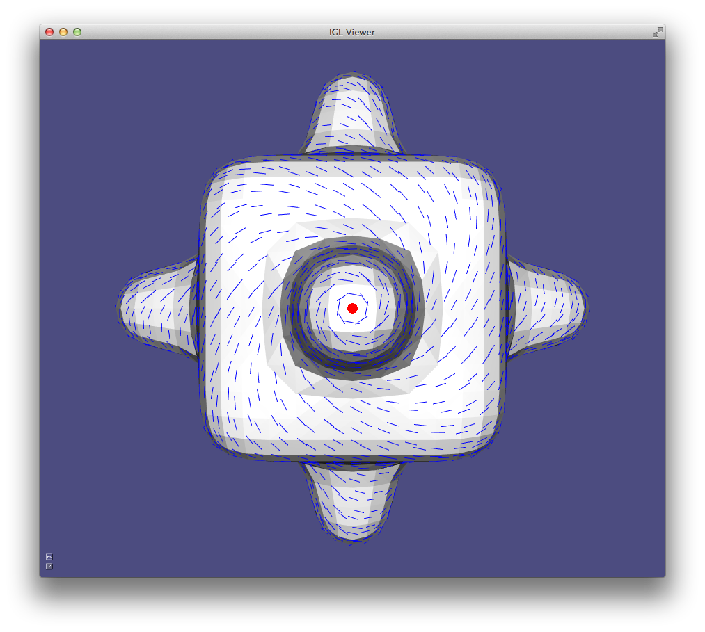

The singularities are vertices where the field vanishes (highlighted in red in
the figure above). `igl::nrosy` can also generate N-RoSy fields [^levy_2008],
which are a generalization of vector fields where in every face the vector is
defined up to a constant rotation of $2\pi / N$. As can be observed in
the following figure, the singularities of the fields generated with different
N are of different types and they appear in different positions.


We demonstrate how to call and plot N-RoSy fields in [Example
504]({{ repo_url }}/tutorial/504_NRosyDesign/main.cpp), where the degree of the field can be change
pressing the number keys. `igl::nrosy` implements the algorithm proposed in
[^bommes_2009]. N-RoSy fields can also be interpolated with many other algorithms,
see the library [libdirectional](https://github.com/avaxman/libdirectional) for
a reference implementation of the most popular ones. For a complete categorization
of fields used in various applications see Vaxman et al. 2016 [^vaxman_2016].


### Global, seamless integer-grid parametrization

The previous parametrization methods were focusing on creating parametrizations
of surface patches aimed at texture mapping or baking of other surface
properties such as normals and high-frequency details. Global, seamless
parametrization aims at parametrizing complex shapes with a parametrization
that is aligned with a given set of directions for the purpose of surface
remeshing. In libigl, we provide a reference  implementation of the pipeline
proposed in the mixed integer quadrangulation paper [^bommes_2009].

The first step involves the design of a 4-RoSy field (sometimes called *cross*
field) that describes the alignment of the edges of the desired quadrilateral
remeshing. The field constraints are usually manually specified or extracted
from the principal curvature directions. In [[Example
506]({{ repo_url }}/tutorial/506_FrameField/main.cpp)], we simply fix one face in a random direction.

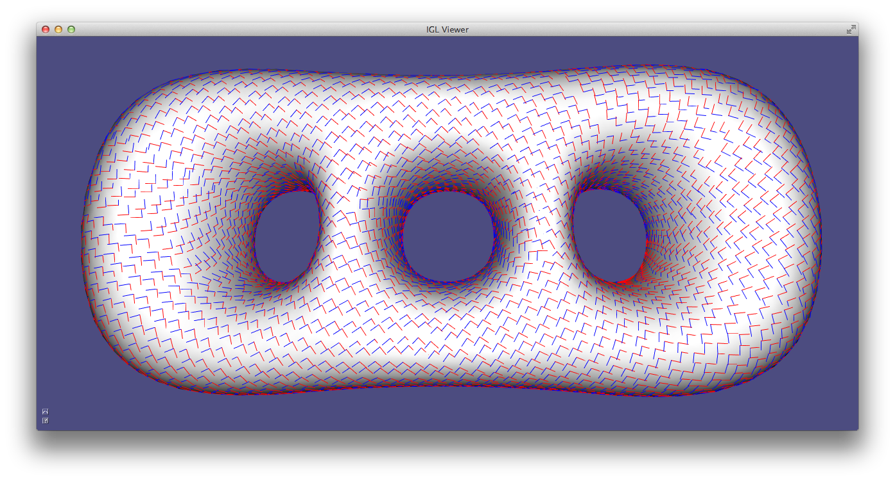

### Combing and cutting

Given the cross field, we now want to cut the surface so that it becomes
homeomorphic to a disk. While this could be done directly on the cross-field, we
opt to perform this operation on its bisector field (a copy of the field
rotated by 45 degrees) since it is more stable and generic. Working on the
bisectors allow us to take as input generalized, non-orthogonal and non-unit
length cross fields.

We thus rotate the field,

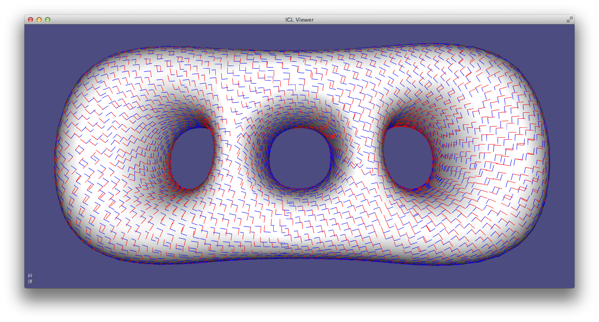

and we remove the rotation ambiguity by assigning to each face a u and a v
direction. The assignment is done with a breadth-first search starting from a
random face.

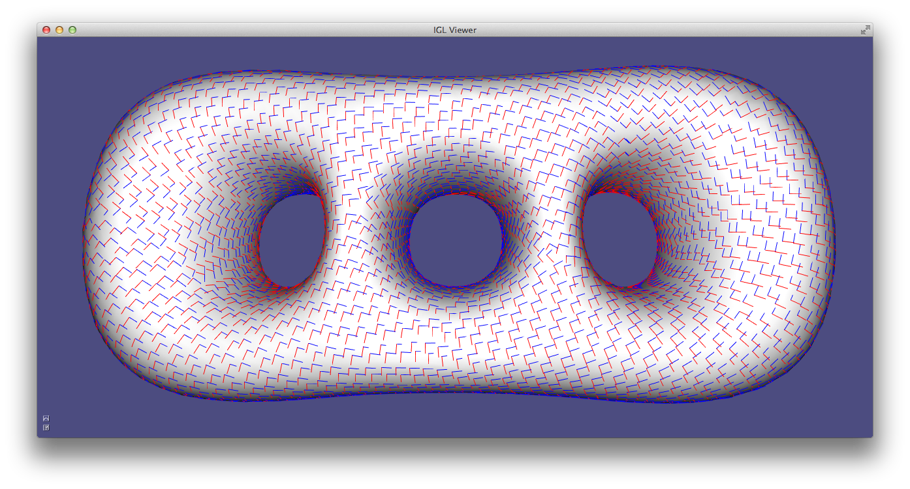

You can imagine this process as combing an hairy surface: you will be able to
comb part of it, but at some point you will not be able to consistently comb
the entire surface ([Hairy ball
theorem](http://en.wikipedia.org/wiki/Hairy_ball_theorem)). The discontinuities
in the combing define the cut graph:

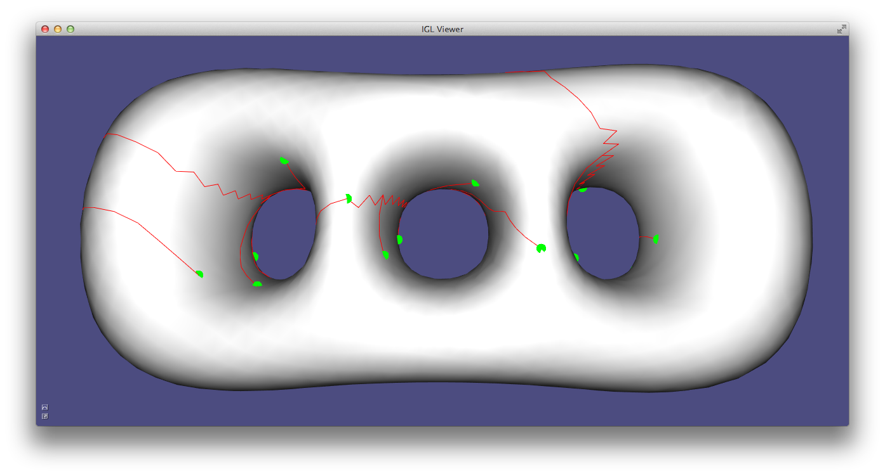

Finally, we rotate the combed field by 45 degrees to undo the initial degrees
rotation:

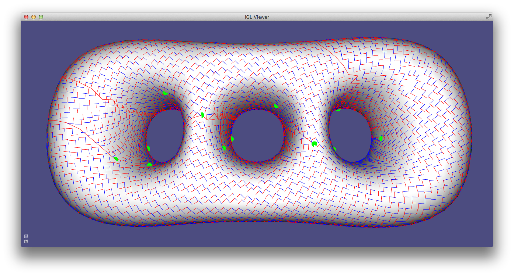

The combed cross field can be seen as the ideal Jacobian of the parametrization
that will be computed in the next section.

### Poisson parametrization

The mesh is cut along the seams and a parametrization is computed trying to
find two scalar functions whose gradient matches the combed cross field
directions. This is a classical Poisson problem, that is solved minimizing the
following quadratic energy:

\\[ E(\mathbf{u},\mathbf{v}) = |\nabla \mathbf{u} - X_u|^2 + |\nabla \mathbf{v} - X_v|^2 \\]

where $X_u$ and $X_u$ denotes the combed cross field. Solving this
problem generates a parametrization whose u and v isolines are aligned with the
input cross field.

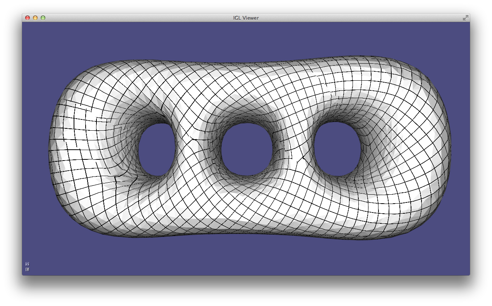

We hide the seams by adding integer constraints to the Poisson problem
that align the isolines on both sides of each seam [^bommes_2009].

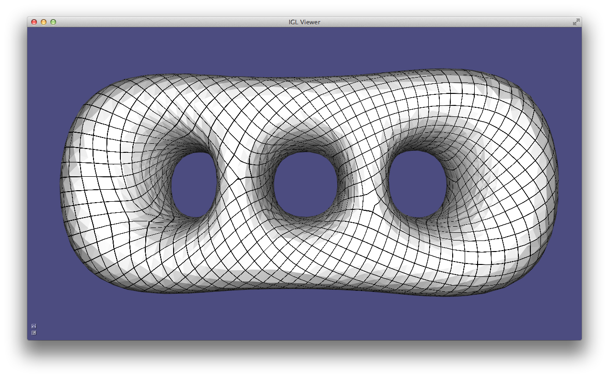

Note that this parametrization can only be used for remeshing purposes, since
it contains many overlaps.

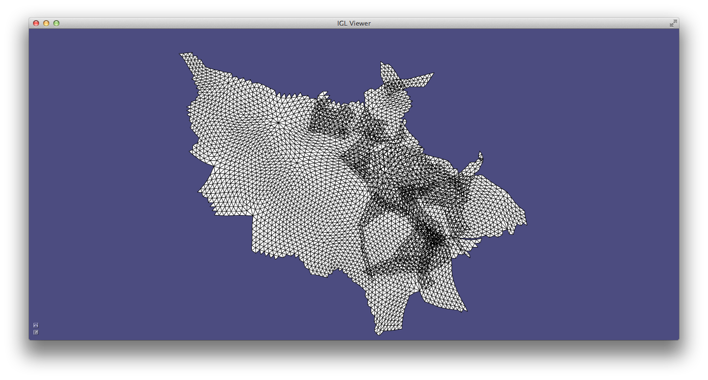

A quad mesh can be extracted from this parametrization using
[libQEx](https://github.com/hcebke/libQEx) (not included in libigl).
The full pipeline is implemented in [Example 505]({{ repo_url }}/tutorial/505_MIQ/main.cpp).

## Anisotropic remeshing

Anisotropic and non-uniform quad remeshing is important to concentrate the
elements in the regions with more details. It is possible to extend the MIQ
quad meshing framework to generate anisotropic quad meshes using a mesh
deformation approach [^panozzo_2014].

The input of the anisotropic remeshing algorithm is a sparse set of constraints
that define the shape and scale of the desired quads. This can be encoded as a
frame field, which is a pair of non-orthogonal and non-unit length vectors. The
frame field can be interpolated by decomposing it in a 4-RoSy field and a
unique affine transformation. The two parts can then be interpolated
separately, using `igl::nrosy` for the cross field, and an harmonic interpolant
for the affine part.

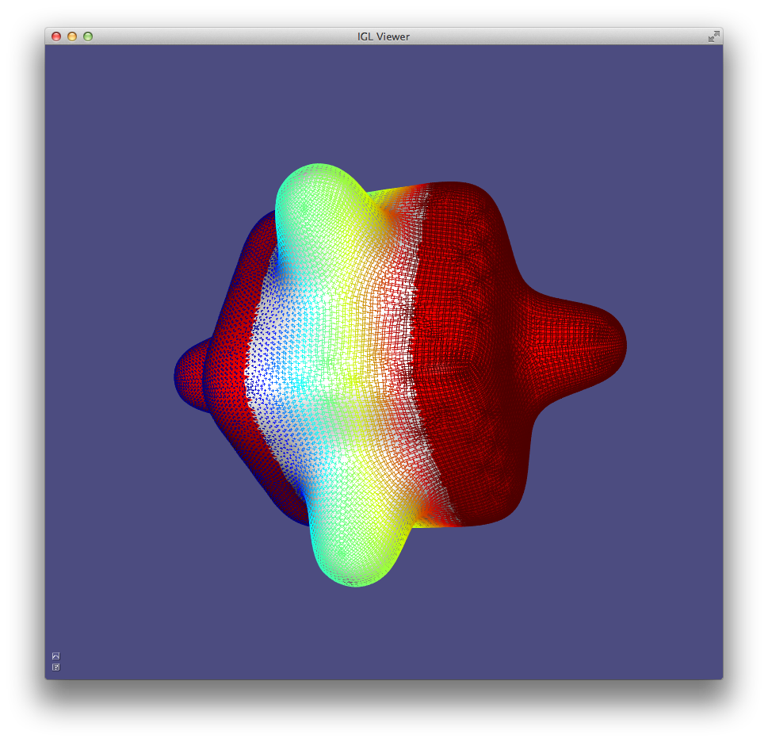

After the interpolation, the surface is warped to transform each frame into an
orthogonal and unit length cross (i.e. removing the scaling and skewness from
the frame). This deformation defines a new embedding (and a new metric) for the
surface.

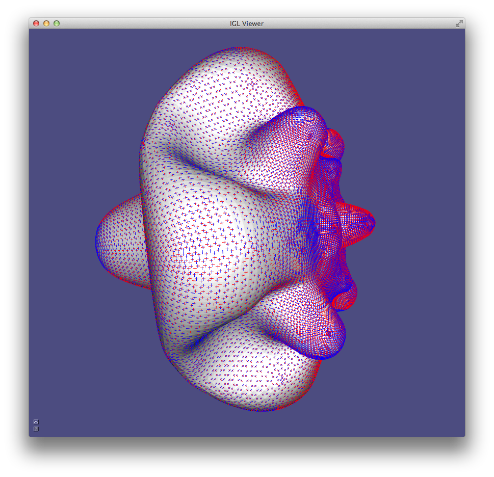

The deformed surface can the be isotropically remeshed using the MIQ algorithm
that has been presented in the previous section.

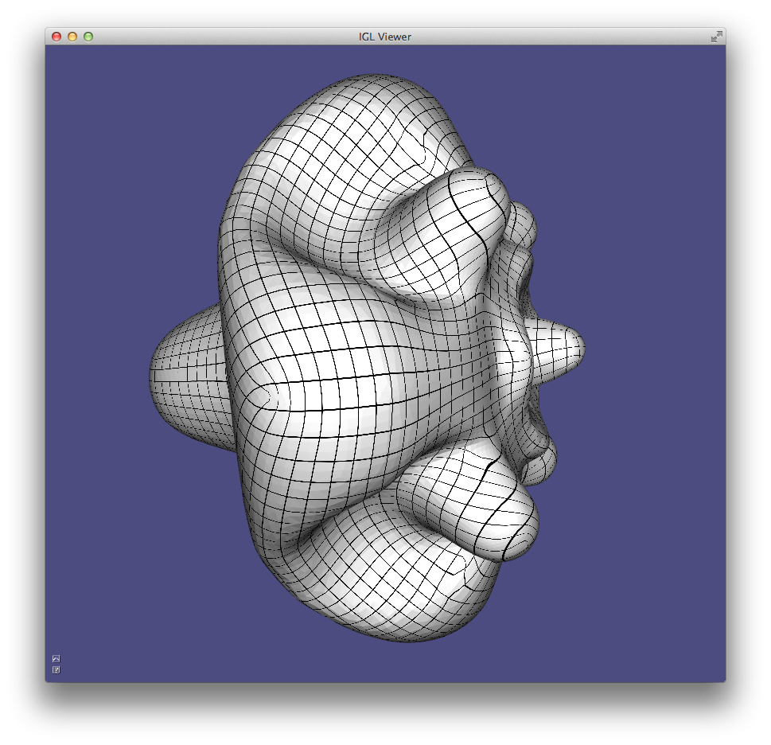

The UV coordinates of the deformed surface can then be used to transport the
parametrization to the original surface, where the isolines will trace a quad
mesh whose elements are similar to the shape prescribed in the input frame
field.

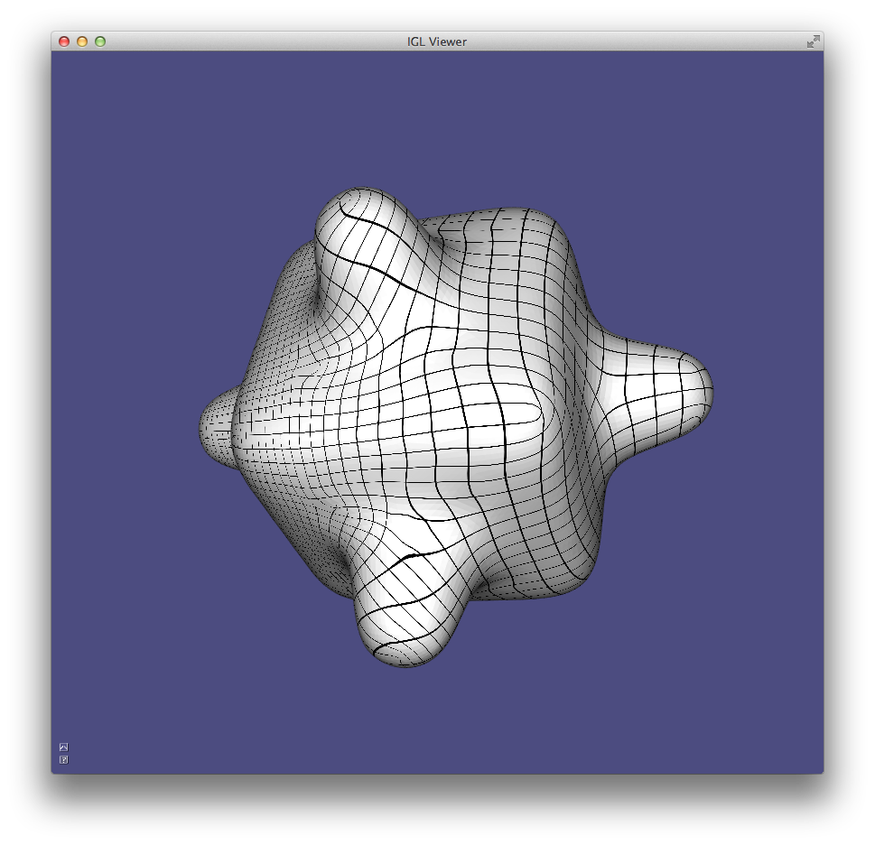

Our implementation ([Example 506]({{ repo_url }}/tutorial/506_FrameField/main.cpp)) uses MIQ to
generate the UV parametrization, but other algorithms could be applied: the
only desiderata is that the generated quad mesh should be as isotropic as
possible.

## Planarization

A quad mesh can be transformed in a planar quad mesh with Shape-Up
[^bouaziz_2012], a local/global approach that uses the global step to enforce
surface continuity and the local step to enforce planarity.

[Example 507]({{ repo_url }}/tutorial/507_Planarization/main.cpp) planarizes a quad mesh until it
satisfies a user-given planarity threshold.

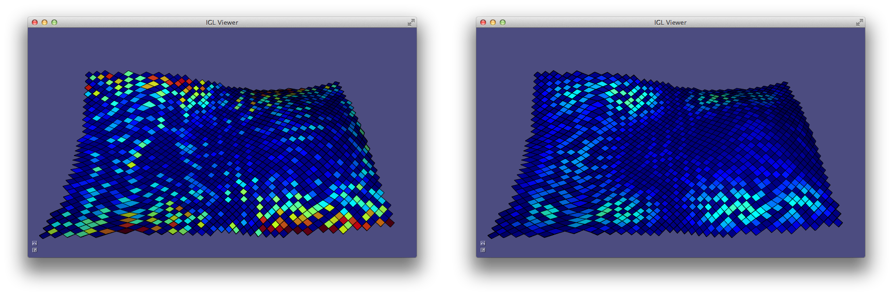

## References

[^bommes_2009]: David Bommes, Henrik Zimmer, Leif Kobbelt. [Mixed-integer quadrangulation](http://www-sop.inria.fr/members/David.Bommes/publications/miq.pdf), 2009.
[^bouaziz_2012]: Sofien Bouaziz, Mario Deuss, Yuliy Schwartzburg, Thibaut Weise, Mark Pauly [Shape-Up: Shaping Discrete Geometry with Projections](http://lgg.epfl.ch/publications/2012/shapeup.pdf), 2012
[^eck_2005]: Matthias Eck, Tony DeRose, Tom Duchamp, Hugues Hoppe, Michael Lounsbery, Werner Stuetzle.  [Multiresolution Analysis of Arbitrary Meshes](http://research.microsoft.com/en-us/um/people/hoppe/mra.pdf), 2005.
[^levy_2002]: Bruno Lévy, Sylvain Petitjean, Nicolas Ray, Jérome Maillot. [Least Squares Conformal Maps, for Automatic Texture Atlas Generation](http://www.cs.jhu.edu/~misha/Fall09/Levy02.pdf), 2002.
[^levy_2008]: Nicolas Ray, Bruno Vallet, Wan Chiu Li, Bruno Lévy. [N-Symmetry Direction Field Design](http://alice.loria.fr/publications/papers/2008/DGF/NSDFD-TOG.pdf), 2008.
[^liu_2008]: Ligang Liu, Lei Zhang, Yin Xu, Craig Gotsman, Steven J. Gortler. [A Local/Global Approach to Mesh Parameterization](http://cs.harvard.edu/~sjg/papers/arap.pdf), 2008.
[^mullen_2008]: Patrick Mullen, Yiying Tong, Pierre Alliez, Mathieu Desbrun. [Spectral Conformal Parameterization](http://www.geometry.caltech.edu/pubs/MTAD08.pdf), 2008.
[^panozzo_2014]: Daniele Panozzo, Enrico Puppo, Marco Tarini, Olga Sorkine-Hornung.  [Frame Fields: Anisotropic and Non-Orthogonal Cross Fields](http://cs.nyu.edu/~panozzo/papers/frame-fields-2014.pdf), 2014.
[^vaxman_2016]: Amir Vaxman, Marcel Campen, Olga Diamanti, Daniele Panozzo, David Bommes, Klaus Hildebrandt, Mirela Ben-Chen. [Directional Field Synthesis, Design, and Processing](https://www.google.com/search?q=Directional+Field+Synthesis+Design+and+Processing), 2016
